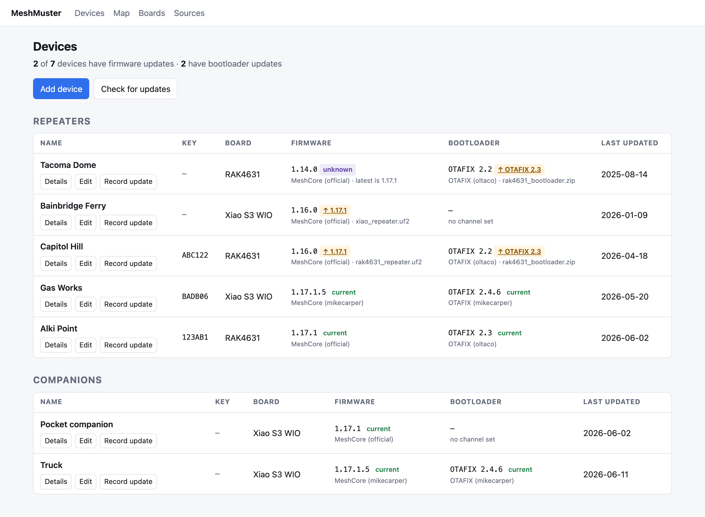
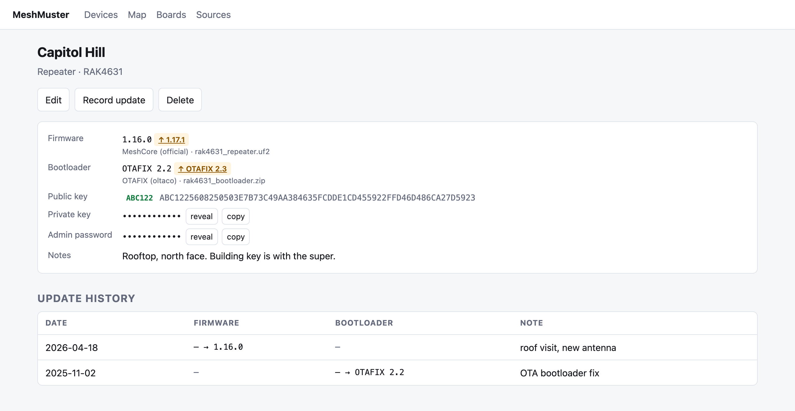
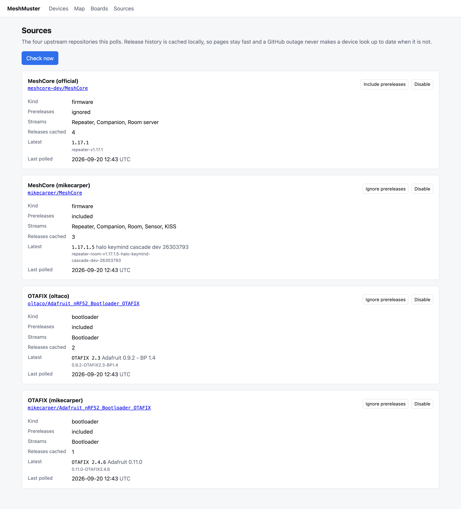
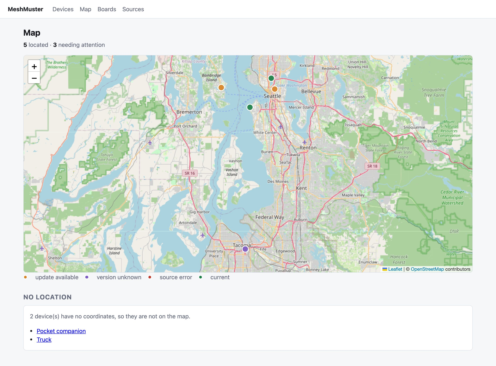

# MeshMuster

Self-hosted firmware and bootloader tracker for MeshCore LoRa mesh nodes.

It tracks board, role, firmware version, bootloader version, last flash date, private key and
admin password for every node I run.

## Screenshots

Every node, key and date in these shots is invented. The app is running against a stub of GitHub,
not my mesh.



An amber badge is a version you could be on, linked to the file for that board.



The device page carries the keys and every flash you've logged.

## Tech stack

- .NET 10 ASP.NET Core (Razor Pages) + [Alpine.js](https://alpinejs.dev)
- SQLite via Entity Framework Core, WAL journaling, migrations by
  [DbUp](https://github.com/DbUp/DbUp)
- [Leaflet](https://leafletjs.com) for maps, tiles from OpenStreetMap
- Hand-rolled Ed25519 point arithmetic, because no library derives keys the way MeshCore does
- GitHub REST API for release polling, cached in the database
- Official MeshCore flasher catalog for KISS releases absent from GitHub Releases
- No login of its own; it expects a proxy in front. See [Security](#security)
- NUnit + [WireMock.Net](https://github.com/WireMock-Net/WireMock.Net) for unit tests,
  [Playwright](https://playwright.dev/dotnet/) for E2E
- Multi-arch Docker images (amd64 + arm64) on Alpine, running unprivileged

## Upstream sources

| Source | Repository | Kind |
|---|---|---|
| MeshCore (official) | [meshcore-dev/MeshCore](https://github.com/meshcore-dev/MeshCore) | firmware |
| MeshCore (mikecarper) | [mikecarper/MeshCore](https://github.com/mikecarper/MeshCore) | firmware |
| OTAFIX (oltaco) | [oltaco/Adafruit_nRF52_Bootloader_OTAFIX](https://github.com/oltaco/Adafruit_nRF52_Bootloader_OTAFIX) | bootloader |
| OTAFIX (mikecarper) | [mikecarper/Adafruit_nRF52_Bootloader_OTAFIX](https://github.com/mikecarper/Adafruit_nRF52_Bootloader_OTAFIX) | bootloader |

The official KISS stream also reads the [MeshCore flasher catalog](https://github.com/meshcore-dev/flasher.meshcore.io/blob/main/config.json); the official GitHub Releases feed does not list those builds. The mikecarper KISS stream reads its own GitHub releases.

Every source keeps its own version scheme. Nothing gets normalized into a common format, because
then you'd be reading a number that matches nothing on the device.

A device follows one firmware source and one bootloader source; its role picks which stream inside
that source it watches. See [Device roles](#device-roles).



**Every mikecarper release is flagged prerelease**, so prereleases are on for both forks by
default. Turn it off for one and the channel goes quiet — which is why the switch is on the
Sources page and not buried in config.

## Device roles

A device's role is what it does on the mesh, and it picks the release stream the device watches
inside its firmware source.

| Role | Import value | Tags it follows |
|---|---|---|
| Repeater | `repeater` | `repeater-v`, `repeater-room-v` |
| Companion | `companion` | `companion-v` |
| Room | `room` | `room-server-v`, `repeater-room-v` |
| Sensor | `sensor` | `utility-v` |
| KISS | `kiss` | `kiss-v` |

One release can serve several roles. mikecarper builds repeater and room from a single
`repeater-room-v` tag where meshcore-dev gives rooms their own, and a bare `v` tag gets sorted by
the files inside it, so one tag can land in five streams. mikecarper spells its sensor channel
`utility-v`, though the releases themselves say sensor builds.

A tag that names its own role is taken at its word. Only a bare `v` gets read from its files,
which is what makes mikecarper's back catalog usable — those tags shipped companion, repeater
and room-server firmware together until they split apart at 1.17.1.2.

Bootloaders have no roles; one stream serves everything.

The device list groups by role in the order above. An unrecognized role sorts to the end instead
of disappearing.

## Security

**There's no login.** MeshMuster expects an authenticating proxy in front of it, on a network you
control. No accounts, no sessions, no authorization checks — anything that reaches the port sees
everything.

**Private keys and admin passwords are encrypted at rest**, AES-256-GCM, under the 32-byte
`SECRET_KEY` you set. The key lives in the environment and not in the state volume. 
They're also masked behind a click and never appear in the device list or a log line.

## Map

Devices with coordinates land on `/Map`, colored by the worst news about them: amber for an
update, purple for an unknown version, red for a source that wouldn't poll, green for current.
Devices without coordinates get listed under the map instead of quietly dropped.



Set a position by clicking the map on a device's edit page, or by typing the numbers straight out
of the repeater's own config; the fields win either way. The picker shows your other located nodes
in gray so you can place one relative to the rest. Nothing is geocoded and nothing is read off the
devices.

Leaflet ships with the app, so `script-src` stays `'self'` and the only outside origin any page
touches is `https://tile.openstreetmap.org`. An E2E test asserts that.

**Opening the map talks to OpenStreetMap.** Your coordinates stay put, but the viewport doesn't,
so anyone watching that traffic learns roughly where your mesh lives. Release polling talks to
GitHub and the official flasher catalog. If that trade isn't worth it, drop the `tileLayer` call in `map.js` and the origin
from `SecurityHeadersPolicy` — markers and popups work fine without a basemap.

## Running

### Docker

```bash
docker run -d --name meshmuster \
  -p 8080:8080 \
  -v meshmuster-state:/state \
  -e SECRET_KEY="$(openssl rand -base64 32)" \
  ghcr.io/mannkind/meshmuster:latest
```

Capture that key somewhere before you run this — generated inline it exists only in the container,
and the next `docker run` without it starts an app that can't read its own database.

### From source

```bash
SECRET_KEY="$(openssl rand -base64 32)" dotnet run --project MeshMuster
```

Comes up on `http://localhost:8080` with an empty database. The schema builds itself on first run,
the four sources get seeded, and it polls GitHub and the official flasher catalog at startup — give it a minute.

To start over, stop it and delete the state directory.

### Browser scripts

The three scripts the pages load are TypeScript under `src/`, compiled into
`MeshMuster/wwwroot` by `tsc`. The compiled `.js` is build output and stays out of git, so a
fresh clone needs one build before the app has any scripts to serve:

```bash
npm ci
npx tsc          # or npm run watch, while editing
```

Leaflet and Alpine are vendored as plain JavaScript and are not compiled. `src/globals.d.ts`
mirrors the two view models the server serialises into the page; nothing checks those against
the C# at build time, so they move together by hand.

### Tests

```bash
npm ci && npx tsc
dotnet build
dotnet test MeshMuster.Tests
dotnet test MeshMuster.E2E -c Release
```

The README images come out of the same harness. That test is marked explicit, so it sits out a
normal run and only fires when you name it:

```bash
dotnet test MeshMuster.E2E -c Release --filter "FullyQualifiedName~Screenshots"
```

## Configuration

Everything the app reads. `SECRET_KEY` is required, the rest are optional, and all of it is
checked at startup — a bad value stops the host instead of turning up as something strange three
hours later.

```
LISTEN_ADDR=:8080                    # default :8080
STATE_PATH=./state                   # the database lives here
DATABASE_PATH=                       # default <STATE_PATH>/meshmuster.db
SECRET_KEY=                          # required; 32 bytes base64, `openssl rand -base64 32`
GITHUB_TOKEN=                        # optional; lifts the API rate limit 60/hr -> 5000/hr
GITHUB_API_BASE_URL=                 # default https://api.github.com
FLASHER_CONFIG_URL=                  # default https://flasher.meshcore.io/config.json
POLL_INTERVAL_HOURS=6                # 1..168
POLL_ON_STARTUP=true
TRUSTED_PROXIES=                     # comma-separated IPs of proxies in front of the app
TRUSTED_NETWORKS=                    # comma-separated CIDR networks
```
